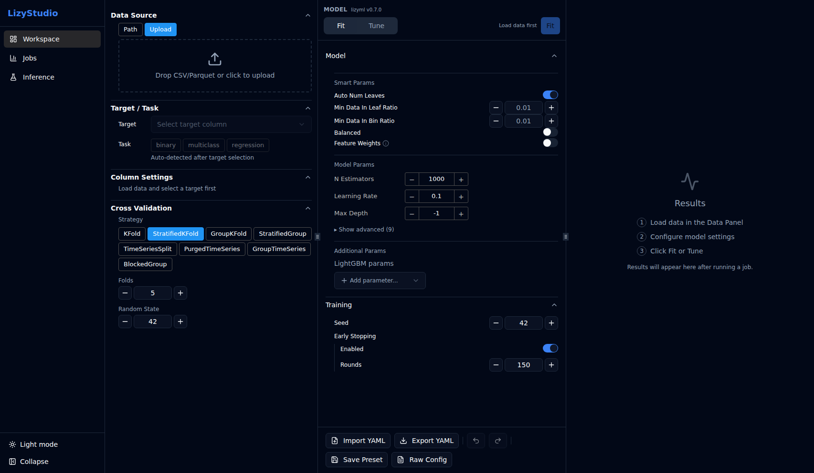
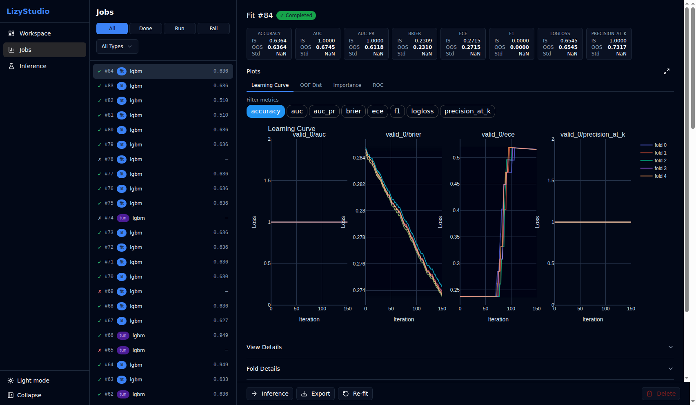
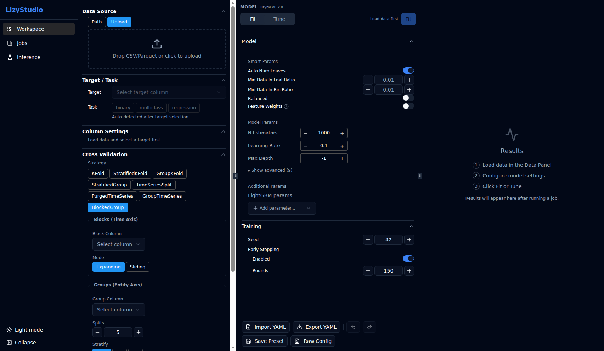

# LizyStudio

[](https://pypi.org/project/lizystudio/)
[](https://pypi.org/project/lizystudio/)
[](LICENSE)
[](https://github.com/nbx-liz/LizyStudio/actions/workflows/ci.yml)

A web-based GUI for machine-learning workflows. Configure, train, evaluate,
tune, and run inference — all from your browser, no code required.

LizyStudio wraps ML backend libraries (starting with
[LizyML](https://github.com/nbx-liz/LizyML)) behind an adapter layer, so the
same interface works across different backends.

<p align="center">
  
</p>

## Features

### Workspace — iterative ML workflow in a single page

Configure data, model parameters, cross-validation, and run training — all
without leaving the page. Results appear in real-time via WebSocket.

- JSON-Schema-driven config forms — backend schemas are rendered automatically;
  no hand-written UI per backend
- CV fold preview and column value distribution bars
- BlockedGroupKFold 2-axis editor for complex split strategies
- Config upload/download (YAML/JSON)

### Jobs — training lifecycle management

<p align="center">
  
</p>

Browse all fit and tune jobs. Inspect metrics, feature importance, learning
curves, and confusion matrices. Export trained models or standalone Python code.

- KPI cards with key metrics at a glance
- Feature importance with kind selection (split, gain, SHAP)
- Learning curve plots with per-fold filtering
- Model export as artifacts or dependency-free Python code

### Tune — hyperparameter optimization

<p align="center">
  
</p>

Define search spaces with fixed/range modes, run Optuna-powered hyperparameter
tuning, and compare trial results.

- Search space editor with default range auto-population
- Real-time trial progress with fold-level scores

### Inference — apply models to new data

Predict on new datasets using any completed job's model. Optionally include
SHAP explanations and evaluate against ground truth.

- Prediction table with pagination
- Evaluation metrics and plots (when ground truth is available)
- Distribution comparison between inference runs
- CSV download of results

### Adapter architecture

Plug in new ML backends by implementing a single Python protocol. The GUI
adapts automatically — no frontend changes needed.

See the [Adapter Guide](docs/adapter-guide.md) for implementation details.

## Requirements

- Python 3.10+

## Installation

```bash
pip install lizystudio
```

## Quick start

```bash
lizystudio              # starts the server on http://localhost:8501
lizystudio --port 9000  # custom port
```

Open your browser and navigate to the URL shown in the terminal.

### Typical workflow

1. **Load data** — upload a CSV/Parquet or select a local file
2. **Configure model** — adjust parameters or use smart defaults
3. **Train** — click Fit (single run) or Tune (hyperparameter search)
4. **Review results** — metrics, plots, and feature importance appear in real-time
5. **Export** — save the trained model or generate standalone Python code
6. **Inference** — apply the model to new data

## Tech stack

| Layer | Technology |
|-------|-----------|
| Backend | Python, FastAPI, Uvicorn |
| Frontend | React 19, TypeScript, Vite |
| UI | Tailwind CSS, shadcn/ui |
| ML backend | [LizyML](https://github.com/nbx-liz/LizyML) (LightGBM + scikit-learn) |
| Type safety | Pydantic → OpenAPI → openapi-typescript |
| Linting | Ruff (Python), Biome (TypeScript) |
| Testing | pytest, Vitest, Playwright |

## Development

### Prerequisites

- Python 3.10+ with [uv](https://docs.astral.sh/uv/)
- Node.js 20+ with [pnpm](https://pnpm.io/) v9

### Setup

```bash
# Clone
git clone https://github.com/nbx-liz/LizyStudio.git
cd LizyStudio

# Backend
uv sync
uv run lizystudio --reload          # dev server on http://localhost:8501

# Frontend (in a separate terminal)
cd frontend
pnpm install
pnpm dev                            # Vite dev server on http://localhost:5173
```

### Commands

```bash
# Backend
uv run pytest                       # run tests
uv run ruff check .                 # lint
uv run ruff format --check .        # format check
uv run mypy src/lizystudio/         # type check

# Frontend
cd frontend
pnpm build                          # production build → src/lizystudio/static/
pnpm check                          # Biome lint + format
pnpm test                           # Vitest
pnpm test:e2e                       # Playwright E2E
pnpm generate:api                   # regenerate API types from OpenAPI
pnpm storybook                      # component development
```

## Documentation

| Document | Description |
|----------|-------------|
| [Architecture](docs/architecture.md) | System overview, layer responsibilities, data flow |
| [API Reference](docs/api.md) | REST endpoints, WebSocket, error codes |
| [Adapter Guide](docs/adapter-guide.md) | How to implement a new ML backend |
| [Contributing](CONTRIBUTING.md) | Development workflow, conventions, quality gates |
| [Changelog](CHANGELOG.md) | Release history |
| [Security](SECURITY.md) | Vulnerability reporting, security design |

## Contributing

Contributions are welcome! Please read the [Contributing Guide](CONTRIBUTING.md)
for the development workflow, commit conventions, and quality requirements.

## License

[MIT](LICENSE)
