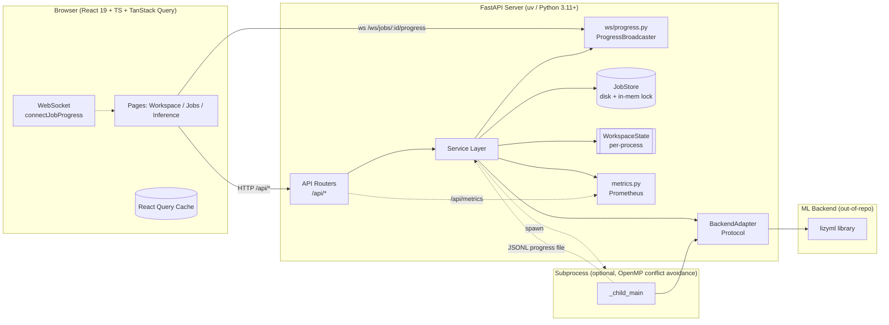
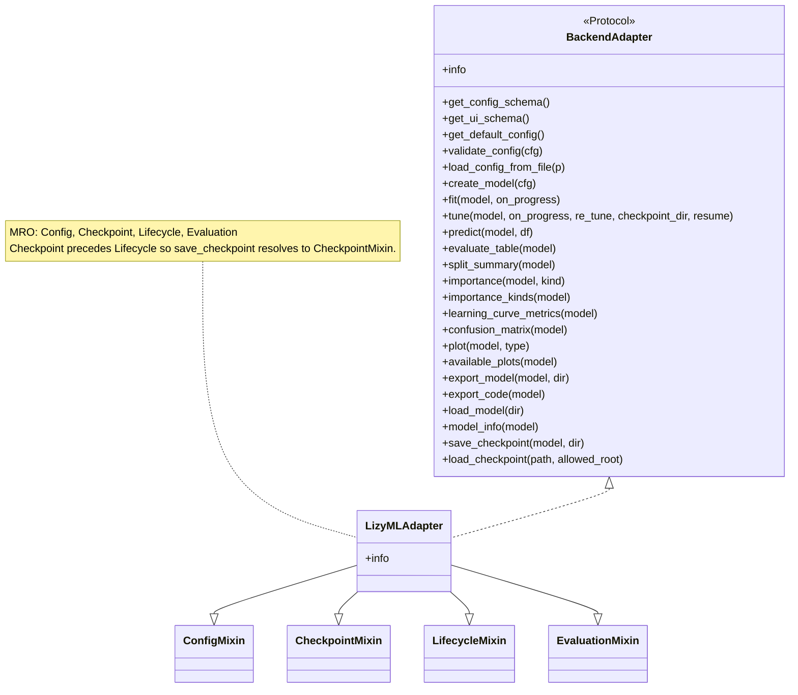
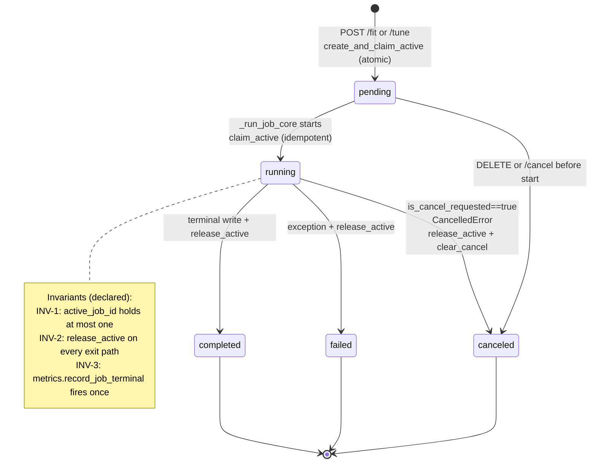
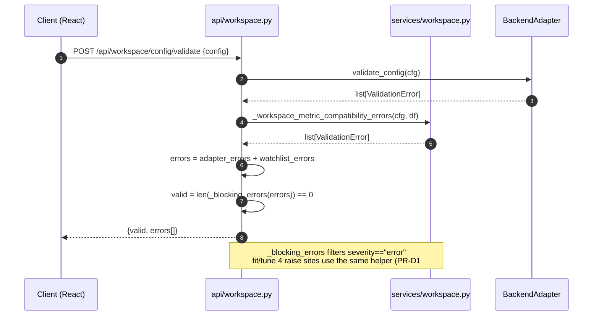
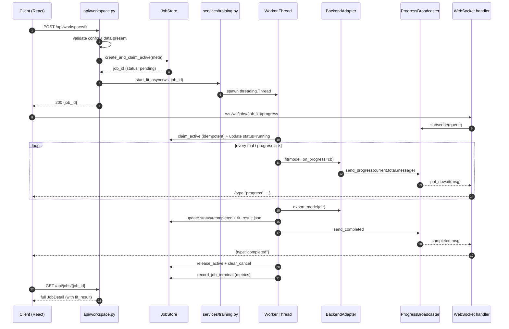
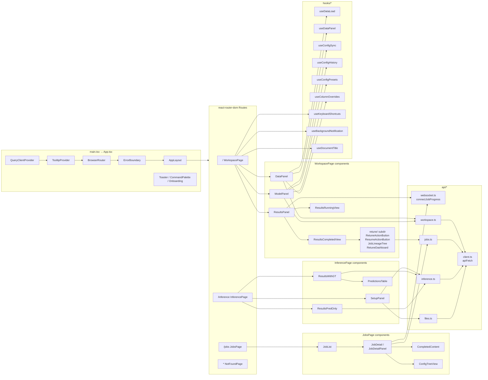

# LizyStudio Architecture (As-Implemented)

2026-04-17 時点の実装から逆算した、現行アーキテクチャの可視化。
BLUEPRINT.md は設計意図、本書は**実装された姿**を示す。

---

## 1. System-Level View

**主要な特徴**:
- API層→Service層→BackendAdapter→ML lib、の3段 Clean Architecture
- Jobの非同期実行は**スレッド実行** or **別プロセス実行**（OpenMP競合検出時に後者）
- 進捗通知は `ProgressBroadcaster` をハブとした pub/sub。子プロセス時は JSONL ファイル経由で親へ中継
- 状態: 永続は `JobStore`（disk）、揮発は `WorkspaceState`（プロセスメモリ）

---

## 2. Backend Layer Map

```mermaid
flowchart TB
  subgraph Entry["Entry / Infrastructure"]
    main[__main__.py]
    cli[cli.py]
    server[server.py]
    security[security.py]
    metrics[metrics.py]
    version[_version.py]
  end

  subgraph API["API Layer  (FastAPI Routers)"]
    apiWorkspace["api/workspace.py<br/>/api/workspace/*"]
    apiJobs["api/jobs.py<br/>/api/jobs/*"]
    apiRetune["api/retune.py<br/>/api/jobs/:id/retune|resume|lineage"]
    apiInference["api/inference.py<br/>/api/inference/*"]
    apiBackends["api/backends.py<br/>/api/backends/*"]
    apiFiles["api/files.py<br/>/api/files/*"]
    apiHealth["api/health.py<br/>/api/health*"]
    apiMetrics["api/metrics_api.py<br/>/api/metrics"]
    errors[api/errors.py]
    models[api/models.py]
  end

  subgraph Service["Service Layer"]
    svcWs[services/workspace.py<br/>WorkspaceState]
    svcJobs[services/jobs.py<br/>JobStore]
    svcTrain[services/training.py]
    svcRetune[services/training_retune.py]
    svcSubp[services/subprocess_runner.py]
    svcData[services/data.py]
    svcInf[services/inference.py<br/>InferenceStore]
    svcExport[services/export.py]
    svcOMP[services/openmp_detect.py]
  end

  subgraph WS["WebSocket"]
    wsProg[ws/progress.py<br/>ProgressBroadcaster]
  end

  subgraph Backends["Backend Adapter"]
    base[backends/base.py<br/>BackendAdapter Protocol]
    registry[backends/registry.py]
    types[backends/types.py<br/>FitSummary / TuneResult / PlotData]
    lizyml[backends/lizyml/adapter.py<br/>LizyMLAdapter]
    mixinC[ConfigMixin]
    mixinL[LifecycleMixin]
    mixinE[EvaluationMixin]
    mixinCkpt[CheckpointMixin]
    serialize[serialization.py]
    pickleC[pickle_compat.py]
  end

  main --> cli --> server
  server --> apiWorkspace & apiJobs & apiInference & apiBackends & apiFiles & apiHealth & apiMetrics
  server --> wsProg & svcJobs & svcWs & registry
  apiJobs --> apiRetune

  apiWorkspace --> svcWs & svcData & svcJobs & svcTrain & errors & models & security
  apiJobs --> svcJobs & svcExport & svcWs & errors & models
  apiRetune --> svcJobs & svcWs & svcTrain & lizyml
  apiInference --> svcInf & svcJobs & svcWs & security & errors & models
  apiBackends --> models
  apiFiles --> security
  apiHealth --> svcWs
  apiMetrics --> metrics

  svcTrain --> svcJobs & svcWs & svcSubp & svcOMP & svcRetune & base & types & metrics
  svcRetune --> svcJobs & svcWs & svcTrain & svcOMP & base & types & metrics
  svcSubp --> svcJobs & svcData & registry & wsProg
  svcJobs --> base & types & metrics & security
  svcInf --> svcJobs & svcData & base & types & security
  svcExport --> svcJobs & base
  svcWs --> base & types

  lizyml --> mixinC & mixinL & mixinE & mixinCkpt
  lizyml --> serialize & pickleC
  registry --> base & lizyml
  mixinC --> types
  mixinL --> types
  mixinE --> types
  mixinCkpt --> security
```

---

## 3. API Surface (as registered)

| Prefix | Router | 代表エンドポイント |
|---|---|---|
| `/api/workspace` | `api/workspace.py` | GET `/status`, POST `/reset`, POST `/data/path`, POST `/data/upload`, GET `/data/preview\|columns\|describe\|split-preview\|column-stats/{c}`, GET/PUT/PATCH `/config`, POST `/config/validate\|upload`, GET `/config/download`, POST `/fit`, POST `/tune` |
| `/api/jobs` | `api/jobs.py` + `api/retune.py` | GET `/`, GET `/{id}` / `{id}/log` / `{id}/config`, DELETE `/{id}?cascade=`, POST `/{id}/cancel`, GET `/{id}/{metrics\|split-summary\|importance\|importance-kinds\|learning-curve/metrics\|plot/{type}\|plots}`, POST `/{id}/export`, GET `/{id}/export-code`, POST `/{id}/retune`, POST `/{id}/resume`, GET `/{id}/lineage` |
| `/api/inference` | `api/inference.py` | POST `/run`, POST `/upload`, GET `/history`, GET `/{inf_id}`, GET `/{inf_id}/{predictions\|metrics\|download\|plot/{type}}`, GET `/{inf_id}/comparison/{other_inf_id}` |
| `/api/backends` | `api/backends.py` | GET `""`, GET `/ui-schema` |
| `/api/files` | `api/files.py` | GET `""` |
| `/api/health` | `api/health.py` | GET `""`, GET `/ready` |
| `/api/metrics` | `api/metrics_api.py` | GET `""` (Prometheus exposition) |
| `/ws/jobs/{job_id}/progress` | `server.py` inline | WebSocket |

---

## 4. Backend Adapter Composition

`backends/registry.py` は `{"lizyml": LizyMLAdapter}` の dict を保持し、
`get_adapter(name="lizyml")` で解決する。server 起動時（`lifespan`）に1度だけ呼ばれ、
`app.state.workspace.backend` に格納される。

---

## 5. Job / Concurrency Topology

### In-memory primitives (`services/jobs.py:JobStore`)
- `_active_job_id: str | None` + `_active_lock: threading.Lock`
- `_cancel_requested: set[str]` + `_cancel_lock`
- `_parent_locks: dict[parent_id, child_id]` + `_parent_lock_mutex` （Re-tune/Resume の at-most-one 保証）

### Disk layout per job (`{jobs_dir}/{job_id}/`)
- `meta.json` — status, config, data_ref, parent_job_id, error
- `fit_result.json` / `tune_result.json`
- `model/` （adapter export） / `model.pkl` + `model_meta.json` （checkpoint）
- `tuning_plot.json` — export前にキャプチャ
- `execution.log` — captured stdout/stderr
- `inferences/{inf_id}/` — `meta.json`, `predictions.parquet`, `metrics.json`

### Thread vs Subprocess（`services/openmp_detect.py:should_use_subprocess`）
- デフォルト: in-process thread
- OpenMP検出 or `LIZYSTUDIO_FORCE_SUBPROCESS=1` → `subprocess.Popen` 分離
- 子プロセス: `python -m lizystudio.services.subprocess_runner`、JSONL progress file を tail
- 親: `_ProgressReader` が JSONL を読み `ProgressBroadcaster.send_progress` に forward

---

## 5.4 Validate envelope flow (P-0100 / P-0101, v0.4.1 で確立)

`POST /api/workspace/config/validate` / `PUT /api/workspace/config` / `POST /api/workspace/upload` の `errors[]` 各要素は `severity: Literal["error", "warning", "info"]`（default `"error"`）と `suggested_fix: str | None` を持つ envelope を返す。

Block 判定の hop:

| 呼び出し元 | 判定ヘルパ | block する severity |
|---|---|---|
| `POST /workspace/config/validate` | `valid = len(_blocking_errors(errors)) == 0` | `"error"` |
| `PUT /workspace/config` | `saved = len(_blocking_errors(errors)) == 0`、422 raise | `"error"` |
| `POST /workspace/upload` | 同上 | `"error"` |
| `POST /workspace/fit` `/tune` | 4 raise sites が `_blocking_errors` 経由（PR-D1 #400） | `"error"` |
| Frontend `isBlockingError(entry)` | `(entry.severity ?? "error") === "error"` | `"error"` |

Frontend は `useModelPanelData` で `errors[]` を `blockingErrors` / `warningEntries` の 2 グループに分割し、ConfigEditorBody が red banner（block）と yellow banner（advisory + suggested_fix）を二段重ねで描画する。

---

## 6. "fit" Request End-to-End Flow

Subprocess モードはステップ 10〜12 が別プロセスで起こり、親が JSONL tail で中継する点だけが異なる（進捗は最終的に同じ `ProgressBroadcaster` に届く）。

---

## 7. Frontend Structure

### 主要な設計選択
- **No global store**: zustand/Redux/Context は使わず、サーバ状態は **TanStack Query cache** が唯一の真実
- ページ間共有は URL の `?job_id=` パラメタ (useSearchParams)
- 進捗は WebSocket → React state（Query cache には入れない）
- Config の draft state は `ModelPanel` 局所: `useConfigSync`（debounce PUT）+ `useConfigHistory`（in-memory undo/redo, 最大50）+ `useConfigPresets`（localStorage）

### React Query キー規約（暗黙）
- Workspace: `["ui-schema"]`, `["config"]`, `["config-schema"]`, `["backends"]`, `["columns"]`, `["files", path]`
- Jobs: `["jobs"]`, `["job", id]`, `["job-detail", id]`, `["job-log", id]`, `["job-plot", id, type]`, `["job-lineage", id]`, etc.
- Inference: `["inf-history", jobId]`, `["inf-record", infId, jobId]`, `["inf-predictions", infId, jobId, page]`, etc.

---

## 8. 設計と実装の主なギャップ（参考）

| 観点 | 実装 | BLUEPRINT との差分 |
|---|---|---|
| Re-tune/Resume/Lineage UI の配置 | Workspace 側 (ResultsCompletedView) | §4.3 は Jobs 画面配置を想定 |
| Protocol のメソッド | save_checkpoint / load_checkpoint / learning_curve_metrics あり | §3.3.2 のコードブロックから一部抜け |
| API `/api/jobs/:id/retune\|resume\|lineage` | 実装済 | §5.3 表に未記載 |
| §10 ディレクトリ構成 | `metrics.py`, `security.py`, `api/health.py`, `api/metrics_api.py`, `api/retune.py`, `backends/lizyml/`（パッケージ化）, `services/subprocess_runner.py` など多数 | 旧ツリーのまま |
| §8.2 frontend テスト | Vitest + Playwright + Storybook + MSW が運用中 | 「初期段階は未整備」のまま陳腐化 |

詳細は Issue #158 / #159 を参照。
