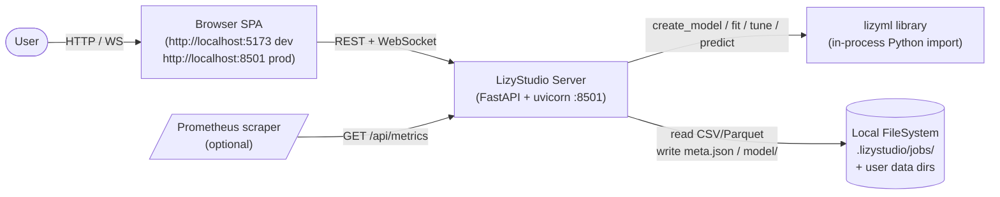
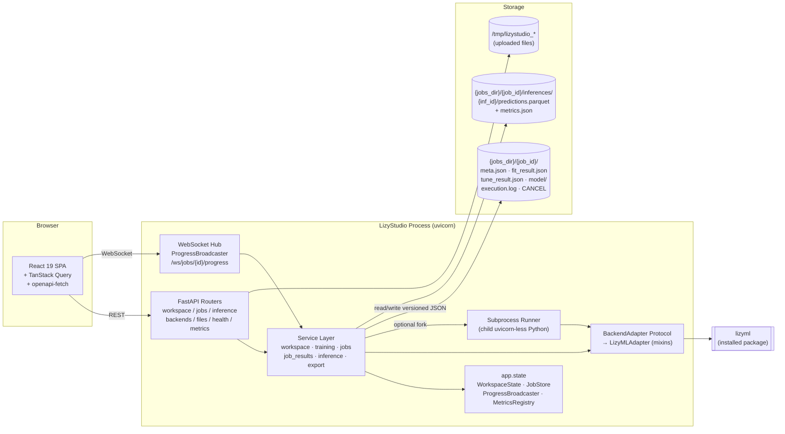
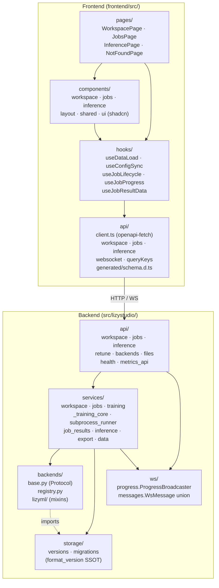
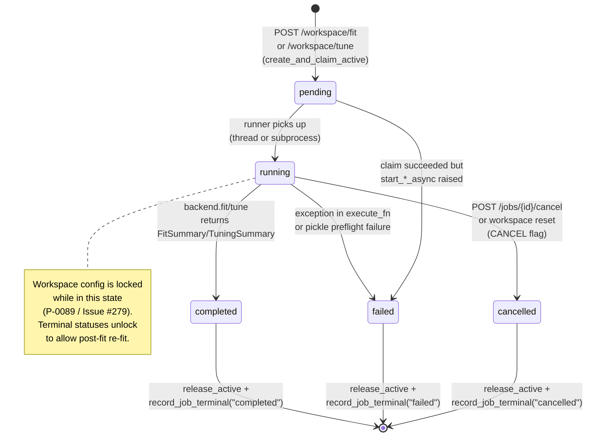
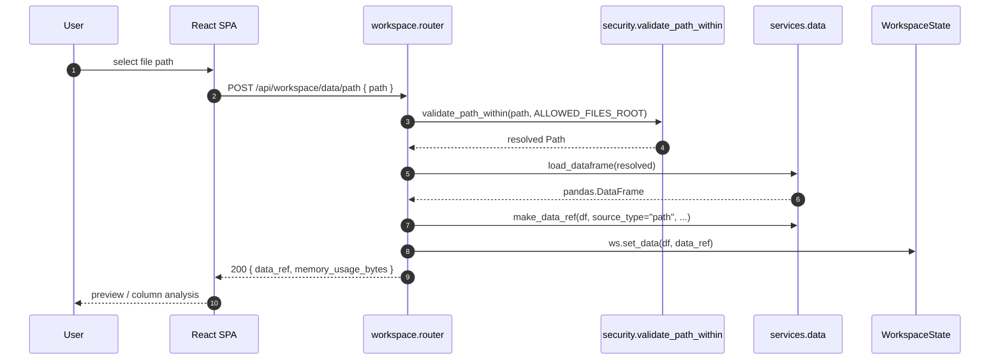
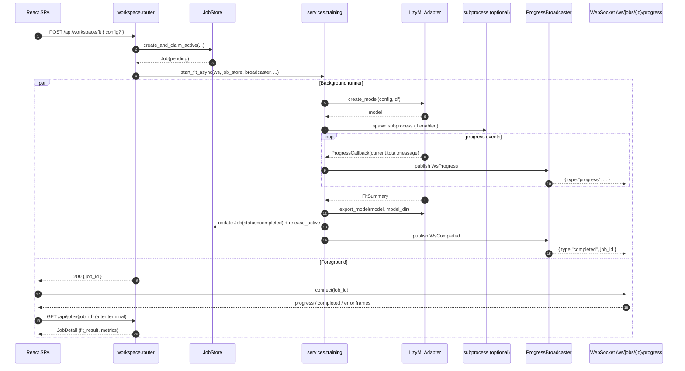
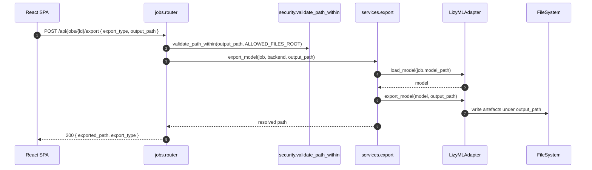
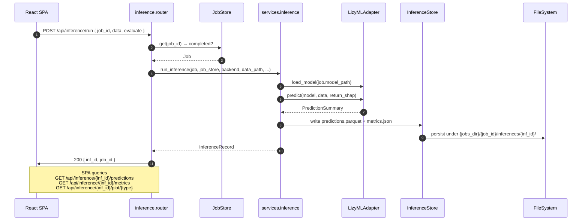

# LizyStudio Architecture Overview

> 本ドキュメントは PyPI リリース v0.3.0 準備の一環として、LizyStudio の主要構造を一望するための補助資料です。 詳細仕様は [BLUEPRINT.md](../BLUEPRINT.md) が正、経緯は [HISTORY.md](../HISTORY.md)、実装スナップショットは [docs/architecture.md](./architecture.md) と [docs/architecture-as-implemented.md](./architecture-as-implemented.md) を参照してください。本書はそれらのドキュメントを置き換えるものではなく、図解による導入レイヤーとして機能します。

---

## 1. System Context (C4 Level 1)

LizyStudio は単一プロセスのデスクトップ向け Web GUI として動作し、ローカルのデータファイルとローカルにインストールされた `lizyml` ライブラリを橋渡しします。ユーザーはブラウザから操作し、外部のクラウドサービスや認証基盤には依存しません。Job 成果物 (`fit_result.json` / `model/` / 推論履歴) はすべてローカルファイルシステムに永続化され、Prometheus 互換のメトリクスエンドポイントが運用観点で外部から参照可能です。

---

## 2. Container View (C4 Level 2)

サーバープロセスは FastAPI アプリケーション 1 個に集約され、内部で API ルーター群・WebSocket Hub・サブプロセスワーカー・ストレージレイヤを協調させます。`uvicorn` の lifespan で `WorkspaceState` / `JobStore` / `ProgressBroadcaster` を `app.state` に組み立て、各リクエストには `Depends(...)` 経由で注入します。重い学習処理は OpenMP デーモンスレッド劣化を避けるため、子プロセスへ切り出して走らせます (H-0036)。

---

## 3. Module Layering

依存方向は常に Browser → API → Service → Adapter → Backend と一方向で、Service 層は backend 固有の型を直接扱わず共通型 (`FitSummary` / `PlotData` / `DataRef`) のみを介します (CLAUDE.md §8)。Storage 層は service が版付き JSON で読み書きする SSOT で、API ルーターは直接ファイルを触りません。フロントエンドも対称な階層 (pages → hooks → api) になっており、`api/generated/schema.d.ts` の自動生成型を経由してドリフトを防ぎます (C-1)。

---

## 4. Job Lifecycle State Machine

Job は `pending` で `JobStore.create_and_claim_active` によりアクティブスロットを原子的に確保し、ランナースレッド/サブプロセスが `running` へ昇格させます。終端は `completed` / `failed` / `cancelled` のいずれかで、終端遷移時に `release_active` がスロットを解放し、Workspace ロックは終端ステータスを許容するキャリーアウト (P-0089) で post-fit re-fit を許可します。`cancelled` への遷移は HTTP `POST /jobs/{id}/cancel` または `POST /workspace/reset` 由来の協調キャンセルにより、ファイル `CANCEL` を介して subprocess へ伝搬します (Issue #152)。

---

## 5. Request → Response Flows

### 5.1 Data load (`POST /api/workspace/data/path`)

ローカルファイルパスからの読込は、まず `validate_path_within(ALLOWED_FILES_ROOT)` で symlink swap 攻撃を排除し、その後 `pandas` で DataFrame 化、`check_dataframe_memory` で OOM を予防、最後に `WorkspaceState` に揮発的に保持します。永続化はせず、ブラウザを閉じれば消える設計です (BLUEPRINT §4.2.3)。

### 5.2 Fit submit + WebSocket streaming

`POST /api/workspace/fit` はバリデーションののち `create_and_claim_active` で原子的に Job レコードを生成、`start_fit_async` がスレッドまたはサブプロセスでランナーを起動します。進捗は `ProgressCallback` を経由して `ProgressBroadcaster` に流れ、購読中の WebSocket クライアントへ JSON で配信されます (`/ws/jobs/{job_id}/progress`)。終端メッセージ受信後にフロントエンドは Job 詳細を再フェッチして結果を表示します。

### 5.3 Export model (`POST /api/jobs/{job_id}/export`)

完了済み Job の保存済みモデルを Adapter 経由で再ロードし、ユーザーが指定したパス (allow-list 内) へ書き出します。コードエクスポート (`GET /api/jobs/{job_id}/export-code`) はテンポラリ ZIP を `BackgroundTasks` で削除する FileResponse として返却します (H-0027)。

### 5.4 Inference run (`POST /api/inference/run`)

完了済み Job をモデル供給元として、別データセットへの予測を行います。データパスを allow-list 検証してから、`run_inference` が Adapter の `predict` を呼び出し、結果を `{jobs_dir}/{job_id}/inferences/{inf_id}/` へ Parquet + JSON で永続化、Ground truth がある場合は metrics も併存します。アップロード由来の一時ファイルはレスポンス前の `finally` で `consume_temp_file` により消去します (HIGH-8)。

---

## 6. Cross-References

- **WHAT (構造定義)**: [BLUEPRINT.md](../BLUEPRINT.md) §0–§5
- **WHY (経緯記録)**: [HISTORY.md](../HISTORY.md) — Proposal P-0086 (atomic config@fit) / P-0089 (workspace running-lock) / H-0036 (subprocess runner) / H-0062 (re-tune lineage) / H-0068 (BackendAdapter split) / H-0083 (CORS + WS origin) / H-0084 (per-app ModelCache)
- **WHEN (フェーズ計画)**: [PLAN.md](../PLAN.md)
- **HOW (詳細スナップショット)**: [docs/architecture.md](./architecture.md), [docs/architecture-as-implemented.md](./architecture-as-implemented.md), [docs/adapter-guide.md](./adapter-guide.md), [docs/api.md](./api.md)
